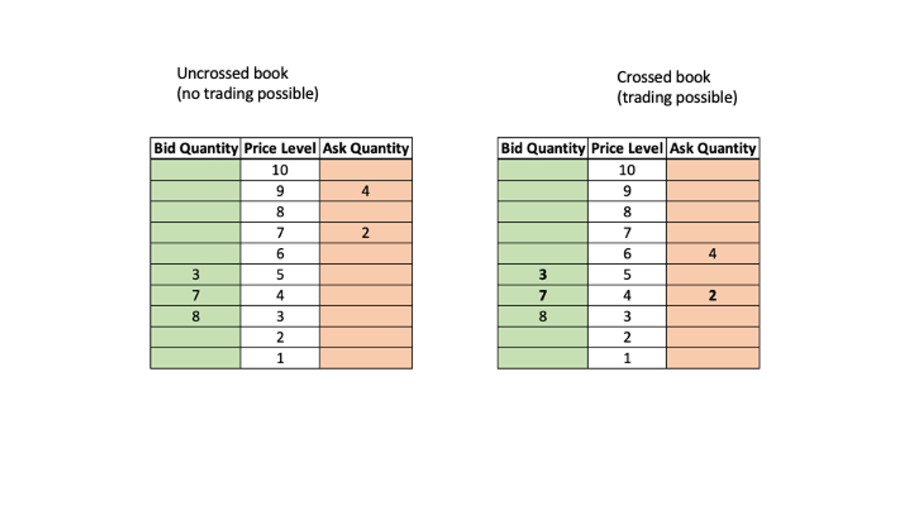

# IMC PROSPERITY : ALGORITHMIC AND MANUAL TRADING ON VIRTUAL SECURITY AND EXCHANGES

### Order Book

Orders for a certain product are collected in something called an Order Book. While there are multiple ways to visualize an Order Book, a common representation is shown below. The middle of the book shows the different price levels. The left side, or bid side, shows the combined quantity of all the BUY orders which have that price associated with them. On the right side, or ask side, the combined quantity of all the sell orders per price level is represented. As described above, once there are buy and sell orders at the same price level, or even buy orders at a price level above the price level of the lowest sell order, orders are matched and trading takes place.

We would call an order book with no bid orders at or above the level of the lowest ask order “uncrossed”. No trading is then possible. If there are buy orders above the lowest price level with ask orders, we would call the book “crossed” and trading is possible.



## Financial Instruments - 

<p float="left">
  
   
</p>

<p float="left">

   
    
</p>

Each financial instrument had a maximum and minimum position limit.
Position limits for some products:

- PEARLS: 20
- BANANAS: 20
- COCONUTS: 600
- PINA_COLADAS: 300
- DIVING_GEAR: 50
- BERRIES: 250


The aim of the challenge was to perform trades on the order book with some securities which were based on their virtual exchange and with other trading bots placing their bid and asks there as well.

We used the mean price of the best bid and best ask as our indicator for the market price.

```py
    best_ask = min(order_depth.sell_orders.keys())
    best_bid = max(order_depth.buy_orders.keys())
    market_price = (best_ask + best_bid)/2
```

The major challenges we faced are below:
- To choose the volume to trade of each instrument while staying in the limits
- To take advantage of correlated products, like Pina-Colada and Coconuts showed a very high positive correlation so we used pairs trading strategies like -
  - Mean reversion
  - Cointegration
  - Volatility based strategies
- The banana product's mean price of the PnLs on using the Mean Reversion Strategies like Bollinger Bands, zscore with threshold to trade

- For Pearls, we used Volume Weighted Average Price as the acceptable price to trade


## Contributors
- [Utkarsh Pandey](https://github.com/Kratos-is-here)
- Liam Murray
- Eshaan
- Swarn
